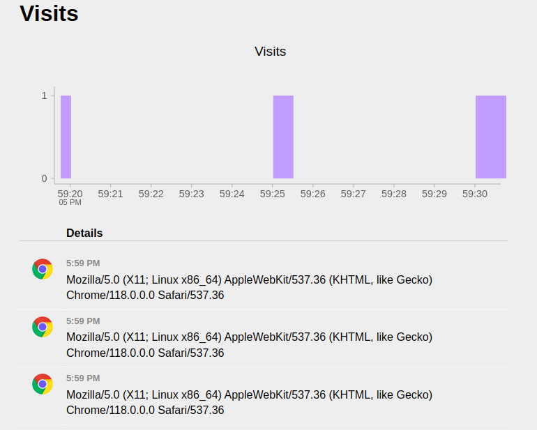

# Terraform Provisioners

Provisioners can be used to model specific actions on the local machine or on a remote machine in order to prepare servers or other infrastructure objects for service.

Terraform can utilize both the local-exec provisioner to run commands on our local workstation, and the remote-exec provisioner to run commands on remote machines.

- Task 1: Upload an SSH keypair to AWS and associate it to an instance.
- Task 2: Create a Security Group that allows SSH access to the instance.
- Task 3: Create a connection block using the SSH keypair.
- Task 4: Use the local-exec provisioner to change permissions on the local SSH key.
- Task 5: Create a remote-exec provisioner to pull down and install a web application.
- Task 6: Apply the configuration and watch for the remote connection.
- Task 7: Pull up the web application and SSH into the web server.

